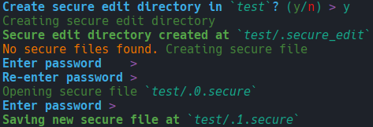

# Secure Edit

- Files encrypted with [AES-512 algorithm](https://en.wikipedia.org/wiki/Advanced_Encryption_Standard)
- Passwords hashed with [PBKDF2](https://en.wikipedia.org/wiki/PBKDF2)
- New version on each save to prevent mishaps
- Decrypted file only every stored in memory
- Edit in your favourite terminal editor
- Pretty colours :)

## Install
`cargo install secure-edit`

## Usage

`secure-edit --dir <directory for encrypted files>`

`secure-edit --help` for more info.
